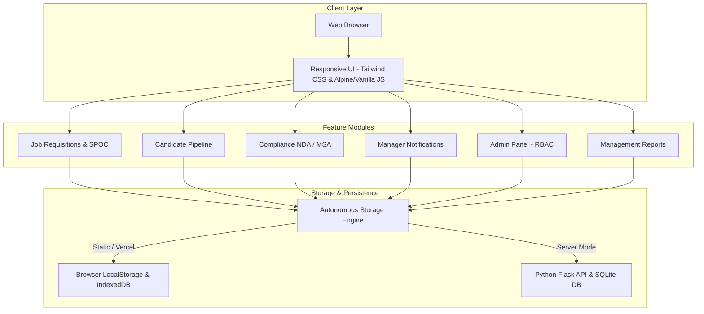
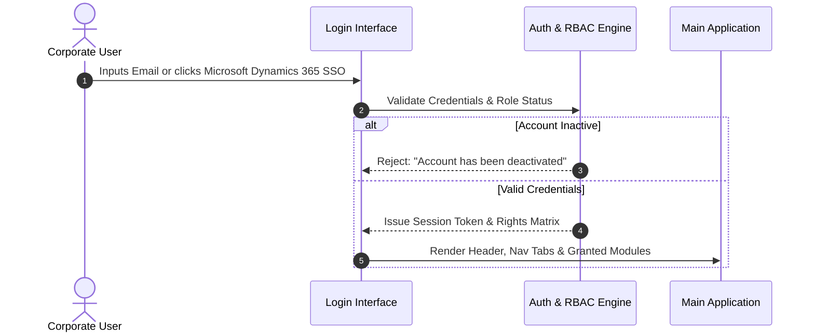
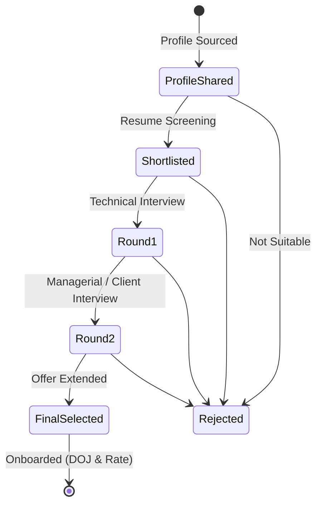
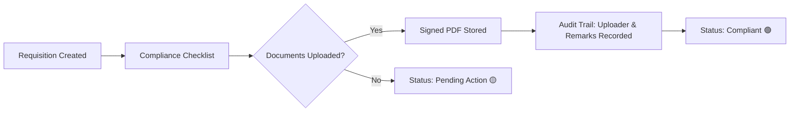
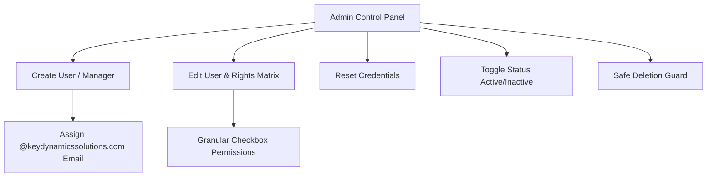

# Key Dynamics Solutions - Recruitment & Job Requirement Management Portal
## End-to-End System & User Guide

**Application Version:** 2.4.0 (Enterprise Edition)  
**Organization:** Key Dynamics Solutions Private Limited  
**System Type:** Autonomous Talent Acquisition & Requisition Management Suite (ATS / RMS)  
**Supported Deployments:** Vercel, Netlify, cPanel, Apache/Nginx, Local Offline  

---

## 📑 Table of Contents
1. [Executive Overview & Architecture](#1-executive-overview--architecture)
2. [Quick Start & Deployment Guide](#2-quick-start--deployment-guide)
3. [Authentication & Role Management](#3-authentication--role-management)
4. [Dashboard & Executive KPI Analytics](#4-dashboard--executive-kpi-analytics)
5. [Job Requirements & SPOC Tracking](#5-job-requirements--spoc-tracking)
6. [Candidate Pipeline & Sourcing Workflows](#6-candidate-pipeline--sourcing-workflows)
7. [Manager Feedback & Notification System](#7-manager-feedback--notification-system)
8. [Compliance & Legal Center (NDA & MSA)](#8-compliance--legal-center-nda--msa)
9. [Admin Control Panel & User Administration](#9-admin-control-panel--user-administration)
10. [Management Reports & Financial Analytics](#10-management-reports--financial-analytics)
11. [Data Security, Backup & Troubleshooting](#11-data-security-backup--troubleshooting)

---

## 1. Executive Overview & Architecture

The **Key Dynamics Solutions Recruitment & Job Requirement Management Portal** is a high-performance Applicant Tracking and Requisition Operations platform designed for staffing firms, IT consulting practices, and corporate recruitment teams.

### Core System Highlights
- **Zero-Dependency Deployment:** Operates autonomously as a modern Single Page Application (SPA). Does not require external database server setup or Docker containers to host.
- **Client Contact Tracking:** Full tracking for Client **SPOC Person Name** and **Mobile Number** on every job order with 1-click calling.
- **Dual Sourcing Channels:** Native differentiation between **Internal Candidates** (CTC, ECTC, Notice Period, Current Location) and **Vendor Candidates** (Vendor Name, Billing Rate, Current Company, Office Mode).
- **Compliance Tracking:** Signed NDA & MSA management across Clients, Sub-Vendors, and Independent Consultants with uploader identity and legal remark auditing.
- **Role-Based Security:** Strict role segregation for Administrators, Hiring Managers, and Technical Recruiters.

---

## 2. Quick Start & Deployment Guide

### Deployment Options

#### Option A: Hosting on Vercel (Recommended for Public Live URL)
1. Log in to [Vercel.com](https://vercel.com).
2. Click **"Add New Project"**.
3. Extract `key-dynamics-recruitment-portal.zip` and drag-and-drop the folder (or push to your GitHub repository and link it).
4. Click **"Deploy"**. Vercel will automatically detect `vercel.json` and serve the application with a public `https://your-domain.vercel.app` HTTPS address.

#### Option B: Netlify (Instant Drag-and-Drop)
1. Go to [Netlify Drop](https://app.netlify.com/drop).
2. Drag and drop the unzipped folder.
3. The site goes live instantly with an active SSL certificate.

#### Option C: cPanel / Hostinger / Shared Web Hosting
1. Log into your hosting control panel (cPanel, Hostinger, GoDaddy).
2. Navigate to `File Manager` &rarr; `public_html`.
3. Upload `index.html` from the package.
4. Your portal is immediately live at your custom domain (e.g., `https://recruitment.keydynamicssolutions.com`).

#### Option D: Offline / Desktop Execution
1. Locate `index.html` on your Desktop or in your Downloads folder.
2. Double-click `index.html` in Windows Explorer.
3. It opens directly in Google Chrome, Microsoft Edge, Mozilla Firefox, or Safari with full persistence.

---

## 3. Authentication & Role Management

The portal enforces enterprise access controls modeled after **Microsoft Dynamics 365** and corporate identity providers.

### Default Corporate Credentials

| Account Role | Corporate Email (`@keydynamicssolutions.com`) | Default Password | Granted Privileges |
| :--- | :--- | :--- | :--- |
| 🛡️ **Administrator** | `admin@keydynamicssolutions.com` | `Admin@123` | Full access: User creation, role rights editing, password reset, requisitions, pipeline, compliance, reports, deletion. |
| 👔 **Hiring Manager** | `manager@keydynamicssolutions.com` | `Manager@123` | Requisitions review, candidate feedback, interview notes, priority notifications, compliance review. |
| 👥 **Recruiter / Staff** | `user@keydynamicssolutions.com` | `User@123` | Requisition creation, candidate sourcing, resume uploads, stage transitions, initial compliance entry. |

### Authentication Methods
1. **Corporate Email Login:** Users can enter their full corporate email (e.g., `admin@keydynamicssolutions.com`) or system username (`admin`) with case-insensitive verification.
2. **Microsoft Dynamics 365 Enterprise SSO (1-Click):**
   - Click the blue **"Sign in with Microsoft Dynamics 365"** button on the login screen.
   - Select an authenticated corporate account from the modal (Administrator, Hiring Manager, or Recruiter).
   - Authenticates immediately without typing passwords.
3. **Change Password:** Users can change their password at any time by clicking their name in the top right header &rarr; **"Change Password"**.

---

## 4. Dashboard & Executive KPI Analytics

Upon authentication, users land on the **Dashboard & Analytics** module (`#sec-dashboard`).

### Metric Overview Cards
- **Total Requisitions:** Number of open and archived requisitions.
- **Open Positions:** Aggregate headcount across all active job orders.
- **Profiles Shared:** Total candidates submitted into the talent pipeline.
- **Final Selections:** Candidates who have cleared all interview rounds and reached `Final Selected` status.

### Real-Time Charts
1. **Recruitment Funnel Chart:** Horizontal bar chart visualizing candidate attrition and throughput across stages:
   $$\text{Funnel: Profile Shared} \rightarrow \text{Shortlisted} \rightarrow \text{1st Round} \rightarrow \text{2nd Round} \rightarrow \text{Final Selected}$$
2. **Work Location Distribution:** Doughnut chart detailing job distribution across `Hybrid`, `Remote`, and `Work From Office`.
3. **Recent Job Requirements Table:** Highlights the latest 5 requisitions with live aging (TAT) pills and client compliance indicators.

---

## 5. Job Requirements & SPOC Tracking

The **Job Requirements** module (`#tab-requirements`) manages all client openings.

### Creating a Job Requisition
Click **"+ Add Requirement"** to launch the creation modal:

| Field Name | Type | Description / Format |
| :--- | :--- | :--- |
| **Client Name \*** | Text | Direct corporate client (e.g., *Apex Tech Solutions*). |
| **End Client Name** | Text | Secondary or implementing client (e.g., *FinTech Global Inc.*). |
| **SPOC Person Name** | Text | Primary client Single Point of Contact (e.g., *Rahul Sharma / Account Manager*). |
| **SPOC Mobile Number** | Telephone | Direct phone number with country code (e.g., *+91 98765 43210*). |
| **Job Title \*** | Text | Designation (e.g., *Senior Full Stack Engineer*). |
| **Work Location Mode \*** | Dropdown | `Hybrid`, `Remote`, or `Work From Office`. |
| **City / Region** | Text | Location (e.g., *New York, NY* or *Bengaluru, KA*). |
| **Budget / Rate** | Text | Approved billing or salary range (e.g., *$140,000/yr* or *$85/hr*). |
| **Open Date \*** | Date | Requisition opening date (defaults to current date). |
| **Open Positions \*** | Number | Headcount quota (minimum 1). |
| **Status \*** | Dropdown | `🟢 Active`, `🟡 On Hold`, `🔵 Filled`, `⚪ Closed`. |
| **Job Description (JD)** | Textarea | Detailed technical skills, responsibilities, and qualifications. |
| **Compliance Checklist** | Checkboxes | Initial flags for Client, Vendor, and Consultant NDA / MSA. |

### Requisition Aging & Turnaround Time (TAT)
The system calculates real-time aging for each requirement:
$$\text{TAT (Active)} = \text{Current Date} - \text{Open Date}$$
$$\text{TAT (Closed / Filled)} = \text{Close Date} - \text{Open Date}$$

- 🟢 **Green Badge:** $\le 15\text{ days}$ (Well within SLA)
- 🟡 **Amber Badge:** $16 - 30\text{ days}$ (Approaching SLA threshold)
- 🔴 **Red Badge:** $> 30\text{ days}$ (Critical aging / escalation required)

### Quick Actions on Requirement Cards
- **Call SPOC:** Clickable phone icon links directly to `tel:[number]` for mobile dialing.
- **Change Status Dropdown:** Directly switch status between `Active`, `On Hold`, `Filled`, or `Closed` without opening the edit modal.
- **Edit Requirement:** Update client details, SPOC, rates, or JD.
- **Add Profile:** Shortcut to submit a candidate directly to this requisition.
- **Delete:** Available to Administrators.

---

## 6. Candidate Pipeline & Sourcing Workflows

The **Candidate Pipeline** module (`#tab-candidates`) oversees talent progression from resume screening to onboarding.

### Adding a Candidate
Click **"+ Add Candidate"** to launch the candidate modal:

#### 1. General Profile Details
- Target Job Requirement selection
- Candidate Full Name, Email Address, and Phone Number

#### 2. Sourcing Channel Differentiation
Choose between **Internal** and **Vendor** sourcing:

##### If "Internal" is selected:
- **Current CTC:** Candidate's current cost to company (e.g., *₹18.5 LPA* or *$110,000*).
- **Expected CTC (ECTC):** Target compensation (e.g., *₹24.0 LPA* or *$135,000*).
- **Notice Period (Days):** Joining lead time (e.g., *15 Days*, *30 Days*, *Immediate*).
- **Current Location:** Candidate's base city (e.g., *Hyderabad* or *Austin, TX*).
- **Remarks:** Internal recruiter screening notes.

##### If "Vendor" is selected:
- **Vendor Name:** Staffing partner agency (e.g., *Apex Talent Partners*).
- **Vendor Billing Rate:** Hourly/monthly vendor rate (e.g., *$75/hr* or *₹1.2L/month*).
- **Current Company:** Candidate's current employer of record.
- **Office Work Type:** Work preference (`Hybrid`, `Remote`, `Work From Office`).

#### 3. Resume Upload
- Accepts PDF, DOC, or DOCX files.
- Resumes are stored and accessible via **"Download Resume"** buttons in the candidate list.

### Stage Progression
Recruiters and Managers can advance candidates through stages:
1. `Profile Shared` &rarr; Submitted to client.
2. `Shortlisted` &rarr; Cleared initial screening.
3. `1st Round` &rarr; Technical evaluation scheduled/completed.
4. `2nd Round` &rarr; Manager / client interview scheduled/completed.
5. `Final Selected` &rarr; Prompt to enter **Date of Joining (DOJ)** and **Final Billing Rate**.
6. `Rejected` &rarr; Archived with reason.

---

## 7. Manager Feedback & Notification System

To facilitate collaboration between technical recruiters and hiring managers:

### Adding Manager Observations & Notes
1. Click **"Notes"** on any candidate card.
2. Enter qualitative feedback (e.g., *"Candidate demonstrated strong microservices and system design skills in round 1"*).
3. **High Priority Notification Flag:**
   - Check **"Flag as High Priority Notification"**.
   - Select priority (`High` or `Critical`).
   - The note is highlighted with a red badge on the candidate profile.

### Header Notification Feed
- The bell icon in the top header displays a live red counter indicating unread manager notifications.
- Clicking the bell reveals a dropdown list showing candidate name, requisition title, priority badge, and manager comment excerpt.
- Clicking any notification takes the user directly to the candidate's profile.

---

## 8. Compliance & Legal Center (NDA & MSA)

The **Compliance (NDA / MSA)** module (`#tab-compliance`) guarantees legal compliance before consultants start billing.

### 6-Point Compliance Matrix
For every job requirement, the portal tracks six agreements:
1. **Client NDA:** Non-Disclosure Agreement signed with the direct client.
2. **Client MSA:** Master Services Agreement executed with the client.
3. **Vendor NDA:** NDA signed with the staffing vendor (if candidate is vendor-sourced).
4. **Vendor MSA:** Sub-contractor agreement with the vendor.
5. **Consultant NDA:** Proprietary information agreement signed by the candidate.
6. **Consultant MSA:** Independent contractor agreement signed by the candidate.

### Uploading Executed Agreements
1. In the Compliance Matrix, locate the requirement and click **"Upload Signed Agreement"** (or click any pending badge).
2. Select the **Agreement Type** (e.g., *Client NDA* or *Vendor MSA*).
3. Attach the scanned document (`.pdf`, `.docx`, `.png`).
4. Enter **Uploader Information** (defaults to current logged-in corporate user).
5. Enter **Legal Remarks** (e.g., *"Executed counter-signed document valid through Dec 2027"*).
6. Click **"Upload & Verify"**.
7. The cell updates to **"Signed"** with a document download link, uploader timestamp, and audit history.

---

## 9. Admin Control Panel & User Administration

The **Admin Panel** (`#tab-admin` labeled **"New User"**) is restricted to users with `Admin` role or `can_access_admin` privileges.

### KPI Statistics
- **Total Registered Users:** All accounts in the tenant directory.
- **Hiring Managers:** Accounts configured with managerial rights.
- **Recruiters & Staff:** Operational recruitment team members.
- **Active Accounts:** Accounts currently permitted to log in.

### Managing Corporate Accounts

#### 1. Creating a New Account
Click **"+ Create User / Manager"**:
- **Full Name:** User's display name.
- **Username:** Unique identifier (e.g., `sanjay.kumar`).
- **Corporate Email:** Pre-configured with `@keydynamicssolutions.com` domain.
- **Initial Password:** Temporary password (minimum 6 characters).
- **Role Selection:**
  - `Admin`: Automatically enables administrative privileges.
  - `Manager`: Pre-selects requisition review, candidate review, and manager feedback rights.
  - `User`: Standard recruiter rights.
- **Granular Permissions Matrix:**

| Permission Key | Right Name | Scope of Access |
| :--- | :--- | :--- |
| `can_manage_requirements` | Manage Requisitions | Create, edit, and update job requisitions. |
| `can_manage_candidates` | Manage Candidates | Add candidate profiles, upload resumes, update stages. |
| `can_post_comments` | Manager Feedback | Post feedback and high-priority notifications. |
| `can_manage_compliance` | Manage Compliance | Upload signed NDA / MSA agreements and remarks. |
| `can_view_reports` | View Reports | Access management reports and placement margins. |
| `can_access_admin` | Admin Access | Access the Admin Control Panel. |

#### 2. Modifying Rights & Resetting Passwords
- Click ✏️ **Edit** to modify full name, corporate email, role, or individual checkbox rights.
- Click 🔑 **Reset Password** to set a new password directly for any employee.
- Click 🚫 / 🟢 **Status Toggle** to activate or deactivate an account (deactivated accounts are immediately blocked from logging in).
- Click 🗑️ **Delete Account** to remove test or departing staff (the primary administrator account is protected from accidental deletion).

---

## 10. Management Reports & Financial Analytics

The **Management Reports** module (`#tab-reports`) delivers operational summaries for leadership.

### Executive Summary Cards
- **Total Resumes Shared:** Total candidates introduced to clients.
- **Total Shortlisted:** Candidates passing initial screening.
- **Total Placed (Closed):** Total candidates reaching `Final Selected` status.
- **Overall Closure Rate:** Percentage of requisitions successfully filled:
  $$\text{Closure Rate} = \left(\frac{\text{Placed Candidates}}{\text{Total Requisitions}}\right) \times 100\%$$

### Client Account Performance Table
Displays performance per client:
- Total Job Requisitions opened
- Total Candidate Resumes shared
- Final Candidate Placements
- Client Conversion Percentage

### Placed Consultants & Billing Margin Table
Details active placements:
- Consultant Name
- Client & Job Title
- Date of Joining (DOJ)
- Approved Billing Rate (e.g., *$95/hr*, *$160,000/yr*)

---

## 11. Data Security, Backup & Troubleshooting

### Data Persistence Architecture
- **In-Memory & Storage Synchronization:** In static hosting mode (Vercel, Netlify, cPanel), all updates are instantly committed to `localStorage` and `IndexedDB`.
- **Session Protection:** Active logins use `sessionStorage` with role authorization checks guarding administrative screens.
- **Clean Navigation:** The raw database center tab is hidden from standard view to maintain an uncluttered enterprise interface.

### Frequently Asked Questions (FAQ)

#### Q1: Can I deploy this application without installing Python or SQLite on my server?
**Yes.** The root package `key-dynamics-recruitment-portal.zip` contains a self-contained Single Page Application (`index.html`) equipped with an autonomous client-side data engine. You can upload it to Vercel, Netlify, or any cPanel web host without installing any backend software.

#### Q2: What happens if I refresh the browser or close my laptop?
All changes—including new job requisitions, candidate sourcing details, SPOC numbers, manager notes, and compliance document uploads—are automatically stored in your browser's persistent storage. Your data remains intact upon refresh.

#### Q3: How do I export or backup all recruitment records?
In the Management Reports screen or Admin Control Panel, administrators can download comprehensive table records. If using the Python backend, the `/api/database/export-sql` endpoint provides a complete standard SQL dump.

#### Q4: How do I add another recruiter or hiring manager?
Log in as `admin@keydynamicssolutions.com`, click the **"New User"** tab in the navigation bar, click **"+ Create User / Manager"**, and assign them their `@keydynamicssolutions.com` email address and role.

---

*Key Dynamics Solutions Private Limited — Enterprise Recruitment & Pipeline Tracker Documentation (v2.4.0)*
